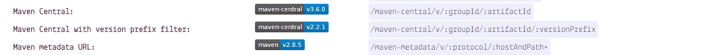

# 《文档模板使用教程》

[](https://gitee.com/daskj/docs-template/tree/master/docs) [](http://daskj.gitee.io/docs-template/)

> 本文档模板是本着```开箱即用```的思想做的,为某些刚上手使用```docsify```但又不清楚如何制作`属于自己的文档`的小伙伴提供的一个模板,以下只是提供了一个常用的配置设置，更多自定义请参考[官方文档](https://docsify.js.org/#/zh-cn/)

## 快速导航

- [肩徽制作](#肩徽制作)
- [文档主题修改](#文档主题修改)
- [侧边导航栏制作](#侧边导航栏制作)
- [评论系统](#评论系统)
- [全局搜索配置](#全局搜索配置)
- [如何启动项目](#如何启动项目)
- [中英文支持](#中英文支持)
- [更多文档平台推荐](#更多文档平台推荐)

# 肩徽制作
> 很多小伙伴可能还不知道如何制作属于自己的肩徽，在这里就一并奉上肩徽制作的方法

## 动态肩徽制作
- 首先,进入[**shields.io**](https://shields.io/)选择自己需要的肩徽类型
- 这里我们用`Version`标签做一下示例
	- 在平常的时候我们经常会见到在Github中Java类项目有如下的肩徽

	

	这样的肩徽标识者当前项目发布在`MavenCenterl`的最新版本号
	- 首先我们先进入`Version`便签，按下`Ctrl+F`打开浏览器搜索框，输入`maven`,我们将会看到有关`Maven`的三个肩徽

	
	- 我们点击`Maven Central`进入制作页面,在groupid和artifactid处输入我们发布到`mavenCentral`的组件,稍后页面会自动搜索查找,在下方实时显示版本肩徽,此时我们只需点击`Copy Badge Url`获取肩徽的url地址,在需要使用的地方使用如下语法即可使用：
	``````

## 静态肩徽制作
- 在[**shields.io**](https://shields.io/)页面中找到`Static`的标签
- 在label处输入肩徽的前半段文字,在message处输入肩徽的后半段文字,选择一个自己喜欢的颜色
	> 在下方有颜色的预览
- 最后点击`Make Badge`跳转到预览界,复制浏览器地址栏中的地址即可使用

# 文档主题修改
> 进入项目目录找到`index.html`找到`<script>`标签中`window.$docsify`处修改`name`即可,同时还需要修改一下HTML界面的```<title>文档制作教程</title>```

# 侧边导航栏制作
> 打开侧边导航栏配置文件`_sidebar.md`,其中已经预设了一、二、三级目录以及样式，可以根据自己的需要修改

# 评论系统
> 评论系统配置可以参考

- [**在个人博客里添加评论系统--Gitalk**](https://www.jianshu.com/p/656e6101bf0f)
- [**官方文档**](https://github.com/gitalk/gitalk)

> 主要的配置都在`index.html`的script脚本中,主要包括以下两个部分

- 配置声明
```js
var gitalkConfig = {
      clientID: '084f309ea8bc385148bc',
      clientSecret: 'fa4bff71adc7fbb44a7ca6deffecc9ec43e29301',
      repo: 'Nodejs-Roadmap',
      owner: 'q-angelo',
      admin: ["q-angelo"],
      distractionFreeMode: false
    };
```
- 插件应用
```js
plugins: [
        function (hook, vm) {
          hook.doneEach(function() {
            var label, domObj, main, divEle, gitalk;
            label = vm.route.path.split("/").pop();
            domObj = Docsify.dom;
            main = domObj.getNode("#main");
            Array.apply(
              null,
              document.querySelectorAll("div.gitalk-container")
            ).forEach(function(ele) {
              ele.remove();
            });
            divEle = domObj.create("div");
            divEle.id = "gitalk-container-" + label;
            divEle.className = "gitalk-container";
            divEle.style = "width: " + main.clientWidth + "px; margin: 0 auto 20px;";
            domObj.appendTo(domObj.find(".content"), divEle);
            gitalk = new Gitalk(
              Object.assign(gitalkConfig, { id: !label ? "home" : label })
            );
            gitalk.render("gitalk-container-" + label);
          });
        }
      ]
```

# 全局搜索配置
- 确保添加`search.js`
`<script src="https://cdn.jsdelivr.net/npm/docsify@4/lib/plugins/search.js"></script>`
- 配置search选项
	**打开`index.html`找到`<script>`标签中`window.$docsify`处**
```js
search: {
      maxAge: 86400000, // 过期时间，单位毫秒，默认一天
      paths: [], // or 'auto'
      placeholder: 'Type to search',

      // 支持本地化
      placeholder: {
        '/zh-cn/': '搜索',
        '/': 'Type to search'
      },

      noData: 'No Results!',

      // 支持本地化
      noData: {
        '/zh-cn/': '找不到结果',
        '/': 'No Results'
      },
      // 搜索标题的最大程级, 1 - 6
      depth: 2
    }
```

# 如何启动项目
- 使用常规方式(NodeJs安装启动)
	- 先确定正确安装了[**NodeJs**](http://nodejs.cn/download/)
	- 安装docsify-cli
		- 使用npm安装
		`npm i docsify-cli -g`
		- 使用yarn安装
		`yarn global add docsify-cli`
	- 配置环境变量(如果之前配置过则忽略)
		- 查看可执行文件所在位置
		`yarn global bin`
		`npm bin -g`
		- 添加进系统环境变量

	- 进入项目目录
		`docsify serve ./docs`

	- 打开浏览器查看 [**http://localhost:3000**](http://localhost:3000)
- 使用docker查看
	(如果你的系统内没有nodejs或是你不想进行繁琐的配置推荐此方法)
	- 获取docsify镜像环境(只有90+M)
	`docker pull quintoandar/docsify`
	- 运行对应容器

	`docker run -d -p 3000:3000 -v /mnt/hgfs/Centos/guide/docs:/docs --name docs quintoandar/docsify`

	(请将`/mnt/hgfs/Centos/guide/docs`替换为你电脑上对应docs的路径)
	- 打开浏览器查看 [**http://localhost:3000**](http://localhost:3000)
- 文档编辑后如何查看修改
	- Linux环境下需要手动刷新浏览器
	- Windows环境下每次文件被修改后,会自动刷新

# 中英文支持
> 由于现在一个地球村的思想,国际化已经是很常见的事,所以文档对英文的支持也是很有必要的

- 在docs目录下创建en-us目录
- 将docs下原来的文件都复制到en-us目录
- 在en-us下的目录翻译为指定语言
- 配置最外层`index.html`下
```js
window.$docsify = {
   coverpage: ['/', '/en-us/']
};
```
- 启动服务，访问 [**http://localhost:3000/#/en-us**](http://localhost:3000/#/en-us)

# 更多文档平台推荐

> 以下是我平常使用的一些好用文档平台和工具,在这里分享一波

- [EOLINKER API一站式服务](https://www.eolinker.com/#/)(**强烈推荐**)
- [Markdown表格在线制作](http://www.tablesgenerator.com/markdown_tables)
- [Apizza API接口管理](https://apizza.net/pro/#/)
- [易文档](https://easydoc.xyz/#/)(**强烈推荐**)
- [石墨文档](https://shimo.im/welcome)
