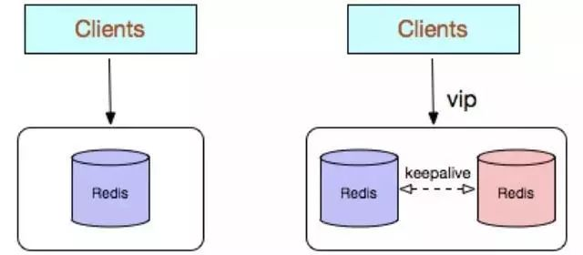
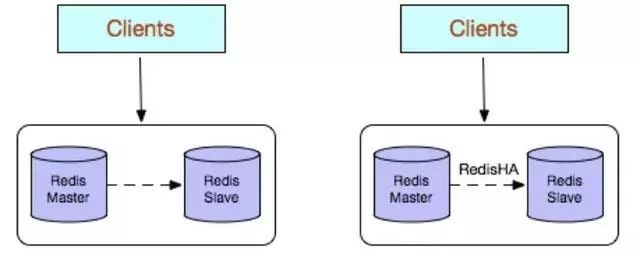
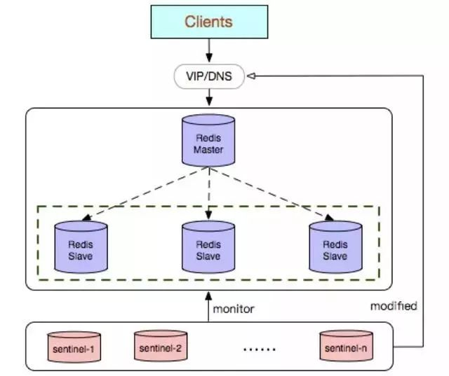
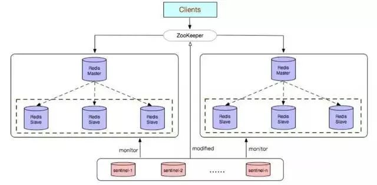
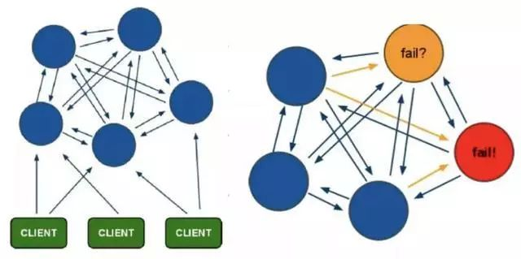
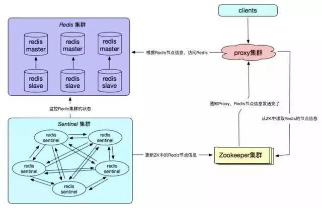

# redis 简介

Redis 是一个开放源码(BSD 许可)、内存中的数据结构存储，用作数据库、缓存和消息代理。 它支持数据结构，比如字符串、散列、列表、集合、带有范围查询的排序集、位图、超级日志、带有半径查询和流的地理空间索引。 Redis 具有内置复制、 Lua 脚本、 LRU 收回、事务和不同级别的磁盘持久性，并通过 Redis Sentinel 提供高可用性服务，并通过 Redis Cluster 提供自动分区。

官网：https://redis.io/

Redis命令手册：http://redisdoc.com/

[*redis*中文官方*网站*](https://www.baidu.com/link?url=owABiSxupQZcsytAk-XgYUt11jn1HqXMBXCX8Q8HLnG&wd=&eqid=cbeab7d20000372d000000025e92de69)

源码：https://github.com/antirez/redis

[redis 源码包](http://download.redis.io/releases/)：http://download.redis.io/releases/

# 为什么要用 redis 

1. 速度快

   速度快，完全基于内存，使用C语言实现，网络层使用epoll解决高并发问题，使用单单线程模型避免了不必要的资源切换。

2. 丰富的数据库类型

   它支持[字符串](https://www.redis.net.cn/tutorial/3508.html)、[哈希表](https://www.redis.net.cn/tutorial/3509.html)、[列表](https://www.redis.net.cn/tutorial/3510.html)、[集合](https://www.redis.net.cn/tutorial/3511.html)、[有序集合](https://www.redis.net.cn/tutorial/3512.html)，[位图](https://www.redis.net.cn/tutorial/3508.html)，[hyperloglogs](https://www.redis.net.cn/tutorial/3513.html)等数据类型。内置复制、[Lua脚本](https://www.redis.net.cn/tutorial/3516.html)、LRU收回、[事务](https://www.redis.net.cn/tutorial/3515.html)以及不同级别磁盘持久化功能

3. 源代码开源

   https://github.com/antirez/redis

4. 高可用和自动分区

   Redis Sentinel 提供高可用性服务， Redis Cluster 提供自动分区。

# Redis 对比 Memcached

Memcached 不支持数据持久化，而 Redis 支持数据的持久化：可以将内存中的数据
保持在磁盘中，重启 redis 服务或者服务器之后可以从备份文件中恢复数据到内存
继续使用。

1. Redis 支持更多的数据类型：支持 string(字符串)、hash(哈希数据)、
   list(列表)、set(集合)、zet(有序集合)
2. Redis 支持数据的备份：可以实现类似于数据的 master-slave 模式的数据备份，
   另外也支持使用快照+AOF。
3. Redis 支持更大的 value 数据：memcache 单个 key value 最大只支持 1MB，
   而 redis 最大支持 512MB。
4. Redis 是单线程，而 memcache 是多线程，所以单机情况下没有 memcache 并发
   高，但 redis 支持分布式集群以实现
5. Redis 支持更高的并发，单 Redis 实例可以实现数万并发。
6. Redis 支持集群横向扩展：基于 redis cluster 的横向扩展，可以实现分布式
   集群，大幅提升性能和数据安全性。Redis 和 memcached 都是基于 C 语言开发。

# Redis特点

- 读写性能优异，支持高并发
- 持久化
- 数据类型丰富
- 单线程
- 数据自动过期
- 发布订阅
- 分布式

# redis 使用场景

Redis 丰富的数据类型，利用这些数据类型的特点，redis 的使用场景主要有一下：

1. 缓存

   Redis支持丰富的数据类型，同时提供了键过期功能，也提供了灵活的键淘汰策略，适合做缓存

2. 计数器

   什么是计数器，如电商网站商品的浏览量、视频网站视频的播放数等。为了保证数据实时效，每次浏览都得给+1，并发量高时如果每次都请求数据库操作无疑是种挑战和压力。Redis提供的**incr**命令来实现计数器功能，内存操作，性能非常好，非常适用于这些计数场景。

3. 排行榜

   很多网站都有排行榜应用的，如京东的月度销量榜单、商品按时间的上新排行榜等。Redis提供的**有序集合**数据类构能实现各种复杂的排行榜应用。

4. 分布式锁

   利用Redis的setnx功能来编写分布式的锁。

5. 消息队列

   消息队列是大型网站必用中间件，如ActiveMQ、RabbitMQ、Kafka等流行的消息队列中间件，主要用于业务解耦、流量削峰及异步处理实时性低的业务。Redis提供了发布/订阅及阻塞队列功能，能实现一个简单的消息队列系统。另外，这个不能和专业的消息中间件相比。

6. 社交列表

   点赞、踩、关注/被关注、共同好友等是社交网站的基本功能，社交网站的访问量通常来说比较大，而且传统的关系数据库类型不适合存储这种类型的数据，Redis提供的哈希、集合等数据结构能很方便的的实现这些功能。

# Redis集群的5种使用方式，及各自优缺点对比分析

## 1、常见使用方式

Redis 的几种常见使用方式包括：

- Redis 单副本
- Redis 多副本(主从)
- Redis Sentinel(哨兵)
- Redis Cluster
- Redis 自研

## 2、各种使用方式的优缺点

**1、Redis 单副本**

Redis 单副本，采用单个 Redis 节点部署架构，没有备用节点实时同步数据，不提供数据持久化和备份策略，适用于数据可靠性要求不高的纯缓存业务场景。

**优点：**

架构简单，部署方便;

高性价比：缓存使用时无需备用节点(单实例可用性可以用 supervisor 或 crontab 保证)，当然为了满足业务的高可用性，也可以牺牲一个备用节点，但同时刻只有一个实例对外提供服务;

高性能。

**缺点：**

不保证数据的可靠性;

在缓存使用，进程重启后，数据丢失，即使有备用的节点解决高可用性，但是仍然不能解决缓存预热问题，因此不适用于数据可靠性要求高的业务;

高性能受限于单核 CPU 的处理能力(Redis 是单线程机制)，CPU 为主要瓶颈，所以适合操作命令简单，排序、计算较少的场景。也可以考虑用 Memcached 替代。

**2、Redis 多副本(主从)**

Redis 多副本，采用主从(replication)部署结构，相较于单副本而言最大的特点就是主从实例间数据实时同步，并且提供数据持久化和备份策略。主从实例部署在不同的物理服务器上，根据公司的基础环境配置，可以实现同时对外提供服务和读写分离策略。

**优点：**

高可靠性：一方面，采用双机主备架构，能够在主库出现故障时自动进行主备切换，从库提升为主库提供服务，保证服务平稳运行;另一方面，开启数据持久化功能和配置合理的备份策略，能有效的解决数据误操作和数据异常丢失的问题;

读写分离策略：从节点可以扩展主库节点的读能力，有效应对大并发量的读操作。

**缺点：**

故障恢复复杂，如果没有 RedisHA 系统(需要开发)，当主库节点出现故障时，需要手动将一个从节点晋升为主节点，同时需要通知业务方变更配置，并且需要让其它从库节点去复制新主库节点，整个过程需要人为干预，比较繁琐;

主库的写能力受到单机的限制，可以考虑分片;

主库的存储能力受到单机的限制，可以考虑 Pika;

原生复制的弊端在早期的版本中也会比较突出，如：Redis 复制中断后，Slave 会发起 psync，此时如果同步不成功，则会进行全量同步，主库执行全量备份的同时可能会造成毫秒或秒级的卡顿;又由于 COW 机制，导致极端情况下的主库内存溢出，程序异常退出或宕机;主库节点生成备份文件导致服务器磁盘 IO 和 CPU(压缩)资源消耗;发送数 GB 大小的备份文件导致服务器出口带宽暴增，阻塞请求，建议升级到最新版本。

**3、Redis Sentinel(哨兵)**

Redis Sentinel 是社区版本推出的原生高可用解决方案，其部署架构主要包括两部分：Redis Sentinel 集群和 Redis 数据集群。

其中 Redis Sentinel 集群是由若干 Sentinel 节点组成的分布式集群，可以实现故障发现、故障自动转移、配置中心和客户端通知。Redis Sentinel 的节点数量要满足 2n+1(n>=1)的奇数个。

**优点：**

Redis Sentinel 集群部署简单;

能够解决 Redis 主从模式下的高可用切换问题;

很方便实现 Redis 数据节点的线形扩展，轻松突破 Redis 自身单线程瓶颈，可极大满足 Redis 大容量或高性能的业务需求;

可以实现一套 Sentinel 监控一组 Redis 数据节点或多组数据节点。

**缺点：**

部署相对 Redis 主从模式要复杂一些，原理理解更繁琐;

资源浪费，Redis 数据节点中 slave 节点作为备份节点不提供服务;

Redis Sentinel 主要是针对 Redis 数据节点中的主节点的高可用切换，对 Redis 的数据节点做失败判定分为主观下线和客观下线两种，对于 Redis 的从节点有对节点做主观下线操作，并不执行故障转移。

不能解决读写分离问题，实现起来相对复杂。

**建议：**

如果监控同一业务，可以选择一套 Sentinel 集群监控多组 Redis 数据节点的方案，反之选择一套 Sentinel 监控一组 Redis 数据节点的方案。

sentinel monitor配置中的建议设置成 Sentinel 节点的一半加 1，当 Sentinel 部署在多个 IDC 的时候，单个 IDC 部署的 Sentinel 数量不建议超过(Sentinel 数量 – quorum)。

合理设置参数，防止误切，控制切换灵敏度控制：

a. quorum

b. down-after-milliseconds 30000

c. failover-timeout 180000

d. maxclient

e. timeout

部署的各个节点服务器时间尽量要同步，否则日志的时序性会混乱。

Redis 建议使用 pipeline 和 multi-keys 操作，减少 RTT 次数，提高请求效率。

自行搞定配置中心(zookeeper)，方便客户端对实例的链接访问。

**4、Redis Cluster**

Redis Cluster 是社区版推出的 Redis 分布式集群解决方案，主要解决 Redis 分布式方面的需求，比如，当遇到单机内存，并发和流量等瓶颈的时候，Redis Cluster 能起到很好的负载均衡的目的。

Redis Cluster 集群节点最小配置 6 个节点以上(3 主 3 从)，其中主节点提供读写操作，从节点作为备用节点，不提供请求，只作为故障转移使用。

Redis Cluster 采用虚拟槽分区，所有的键根据哈希函数映射到 0～16383 个整数槽内，每个节点负责维护一部分槽以及槽所印映射的键值数据。

**优点：**

无中心架构;

数据按照 slot 存储分布在多个节点，节点间数据共享，可动态调整数据分布;

可扩展性：可线性扩展到 1000 多个节点，节点可动态添加或删除;

高可用性：部分节点不可用时，集群仍可用。通过增加 Slave 做 standby 数据副本，能够实现故障自动 failover，节点之间通过 gossip 协议交换状态信息，用投票机制完成 Slave 到 Master 的角色提升;

降低运维成本，提高系统的扩展性和可用性。

**缺点：**

Client 实现复杂，驱动要求实现 Smart Client，缓存 slots mapping 信息并及时更新，提高了开发难度，客户端的不成熟影响业务的稳定性。目前仅 JedisCluster 相对成熟，异常处理部分还不完善，比如常见的“max redirect exception”。

节点会因为某些原因发生阻塞(阻塞时间大于 clutser-node-timeout)，被判断下线，这种 failover 是没有必要的。

数据通过异步复制，不保证数据的强一致性。

多个业务使用同一套集群时，无法根据统计区分冷热数据，资源隔离性较差，容易出现相互影响的情况。

Slave 在集群中充当“冷备”，不能缓解读压力，当然可以通过 SDK 的合理设计来提高 Slave 资源的利用率。

Key 批量操作限制，如使用 mset、mget 目前只支持具有相同 slot 值的 Key 执行批量操作。对于映射为不同 slot 值的 Key 由于 Keys 不支持跨 slot 查询，所以执行 mset、mget、sunion 等操作支持不友好。

Key 事务操作支持有限，只支持多 key 在同一节点上的事务操作，当多个 Key 分布于不同的节点上时无法使用事务功能。

Key 作为数据分区的最小粒度，不能将一个很大的键值对象如 hash、list 等映射到不同的节点。

不支持多数据库空间，单机下的 redis 可以支持到 16 个数据库，集群模式下只能使用 1 个数据库空间，即 db 0。

复制结构只支持一层，从节点只能复制主节点，不支持嵌套树状复制结构。

避免产生 hot-key，导致主库节点成为系统的短板。

避免产生 big-key，导致网卡撑爆、慢查询等。

重试时间应该大于 cluster-node-time 时间。

Redis Cluster 不建议使用 pipeline 和 multi-keys 操作，减少 max redirect 产生的场景。

**5、Redis 自研**

Redis 自研的高可用解决方案，主要体现在配置中心、故障探测和 failover 的处理机制上，通常需要根据企业业务的实际线上环境来定制化。

**优点：**

高可靠性、高可用性;

自主可控性高;

贴切业务实际需求，可缩性好，兼容性好。

**缺点：**

实现复杂，开发成本高;

需要建立配套的周边设施，如监控，域名服务，存储元数据信息的数据库等;

维护成本高。